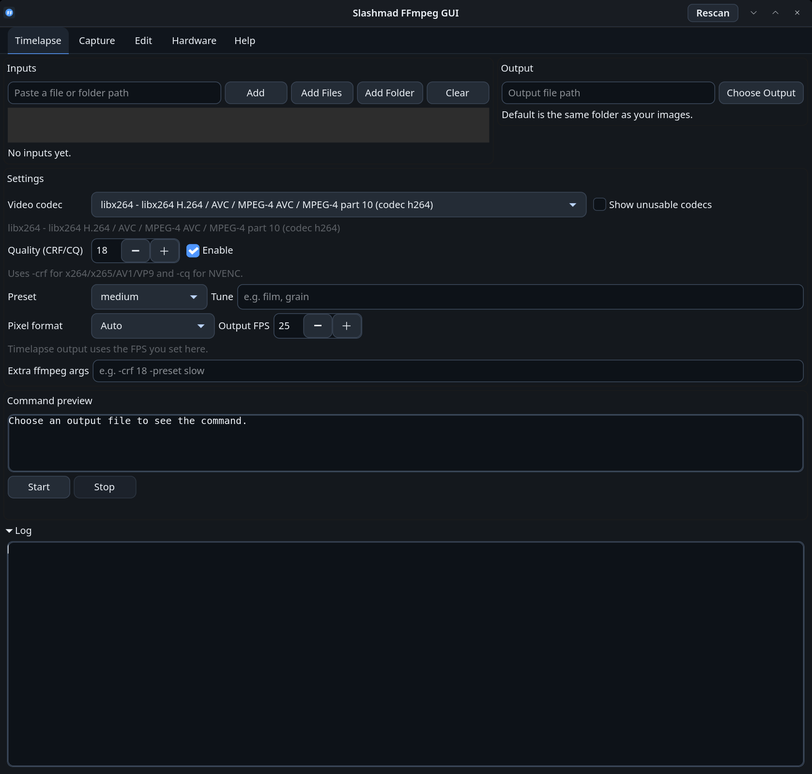
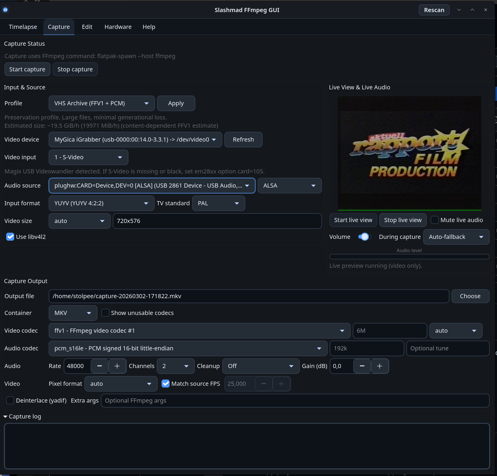
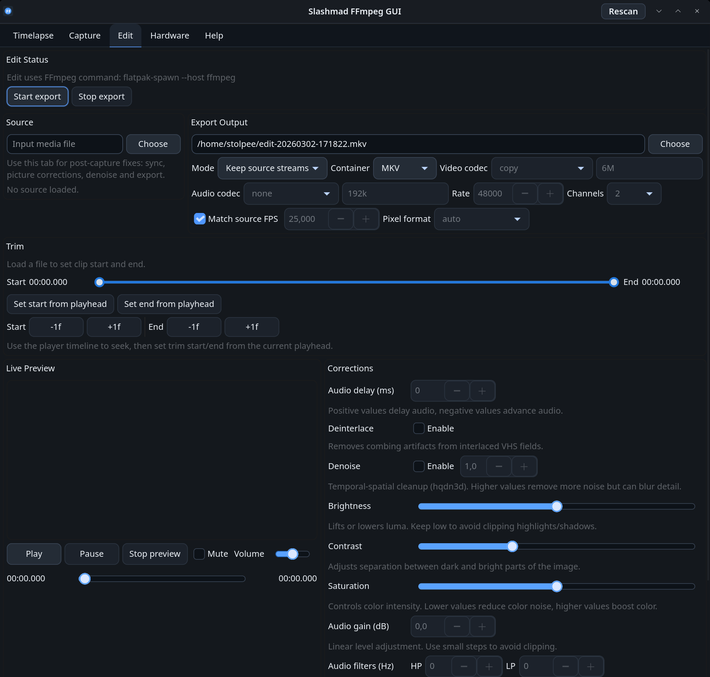
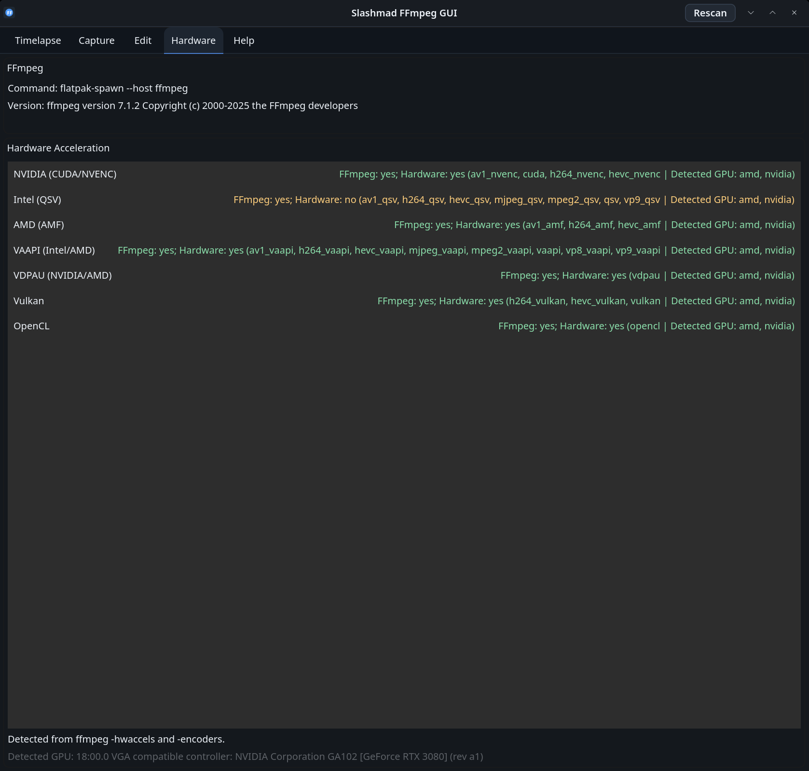

<table>
  <tr>
    <td width="132" valign="top">
      
    </td>
    <td valign="top">
      <h1>SlashmadFFmpegGUI</h1>
      <p>GTK4 frontend for FFmpeg maintained by <code>slashmad</code>, focused on timelapse, capture, review, trimming, cleanup, and export workflows.</p>
    </td>
  </tr>
</table>

Repository:
`https://github.com/slashmad/SlashmadFFmpegGUI`

License:
`GPL-3.0-or-later`

## Features

- FFmpeg encode (`Timelapse`) workflow with hardware-acceleration detection.
- Dedicated `Capture` tab for VHS, USB, PCI, and PCIe capture devices.
- Dedicated `Trim` tab with in-app playback, trim controls, frame stepping, and export.
- Dedicated `VapourSynth` tab for script-based post-processing and export.
- Dedicated `VSRepo` tab for host dependency checks and install guidance.
- Live video and live audio monitoring with independent mute and volume control.
- Capture profiles for archive, delivery, and proxy outputs.
- Analog source input selection for devices exposing `Composite` / `S-Video`.
- Explicit FFmpeg command preview for capture and export jobs.
- Flatpak support with host-device discovery via `flatpak-spawn --host`.
- Compact custom dark GTK styling tuned for capture, review, and long-session editing.

## VapourSynth & VSRepo

- Pipeline presets for VHS workflows:
  - `VHS QTGMC Balanced (Auto/BFF/TFF)`
  - `VHS QTGMC Stable (less shimmer)`
  - `VHS QTGMC Clean Test (minimal)`
  - `VHS BWDIF Fast (quick preview/export)`
  - `VHS Backup Export`
- Full QTGMC deinterlace speed list in UI:
  - `Placebo`, `Very Slow`, `Slower`, `Slow`, `Medium`, `Fast`, `Faster`, `Very Fast`, `Super Fast`, `Ultra Fast`, `Draft`
- Advanced QTGMC controls exposed in UI:
  - `SourceMatch`, `MatchPreset`, `MatchPreset2`, `MatchTR2`
  - `TR0/TR1/TR2`, `Lossless`, `Sharpness`
  - `EZDenoise` / `EZKeepGrain`, `InputType`, `FPSDivisor`, `Tuning`, extra raw args
- Source loading and fallback logic in generated scripts:
  - `ffms2` -> `lsmas` -> `bestsource` (with plugin load attempts from common host paths)
- Auto field-order support:
  - `Auto/TFF/BFF` in UI with automatic fallback and idet-assisted detection notes.
- Export controls:
  - Rate control (`Bitrate` / `CRF`) and explicit speed preset for `libx264`/`libx265`
  - Encoder preset list: `ultrafast` ... `placebo`
  - Auto FPS from VS output (recommended for bob/QTGMC double-rate exports)
- VSRepo tab shows:
  - Installed/missing plugin chain for selected preset
  - Practical install command suggestions for host setup
  - FFmpeg export support overview (container/codec availability)

## Edit Workflow Notes

- Load a captured file in `Edit`.
- Use the built-in player transport (`Play`, `Pause`, seek timeline) to inspect the source.
- The trim bar uses one combined range with `start` and `end` handles.
- Use the dedicated `-1f` / `+1f` buttons under the trim bar for manual frame-accurate start/end adjustment.
- Default export mode is `Keep source streams`, which trims/remuxes without re-encoding.
- Switch to `Re-encode` when applying denoise, deinterlace, color correction, sync changes, or new codecs.

## VHS Capture Notes

- For em28xx-based hardware, `Live during capture = Stop live view` is still the most stable path.
- `Auto-fallback` can be used if you want monitoring during capture and accept fallback to lighter preview behavior when needed.
- The app keeps default archive capture as raw stereo with no tonal cleanup enabled by default.
- Prefer stable ALSA identifiers shown in the UI (`plughw:CARD=...,DEV=...`) over boot-dependent `hw:X,Y` numbers.
- Typical use case: digitizing VHS on Linux from a Magix USB capture device or similar USB analog-video hardware.

Suggested archive baseline:

- Profile: `VHS Archive (FFV1 + PCM)`
- Container: `MKV`
- Video codec: `ffv1`
- Audio codec: `pcm_s16le`
- TV standard: `PAL`
- Input format: `YUYV` mapped to FFmpeg `yuyv422`

Approximate size rates shown in the UI:

- `VHS Archive (FFV1 + PCM)`: about `~19.4 GiB/h`
- `VHS Delivery (H.264 + AAC)`: about `~2.6 GiB/h`
- `VHS Proxy (MJPEG + PCM)`: about `~9.0 GiB/h`

## Magix S-Video Fix (em28xx `card=105`)

If `Composite` works but `S-Video` is black, force em28xx board profile `105`.

Temporary test:

```bash
sudo modprobe -r em28xx_v4l em28xx_alsa em28xx
sudo modprobe em28xx card=105 usb_xfer_mode=1
sudo modprobe em28xx_v4l
```

Permanent setup:

```bash
sudo tee /etc/modprobe.d/em28xx-magix.conf >/dev/null <<'EOF2'
options em28xx card=105 usb_xfer_mode=1
EOF2
```

Reload modules:

```bash
sudo modprobe -r em28xx_v4l em28xx_alsa em28xx
sudo modprobe em28xx
sudo modprobe em28xx_v4l
```

## Run Locally (Fedora)

Typical dependencies:

- `python3`
- `python3-pip` for `pip install -e .`
- `python3-gobject`
- `gtk4`
- `ffmpeg` (includes `ffprobe`)
- `v4l-utils`
- `alsa-utils` for `arecord`
- `pulseaudio-utils` for `pactl`
- `gstreamer1`
- `gstreamer1-plugins-base`
- `gstreamer1-plugins-good`
- `gstreamer1-plugins-bad-free`
- `gstreamer1-plugins-bad-free-gtk4`
- `vapoursynth` (provides `vspipe`)

Optional but useful:

- `pipewire-utils` for extra PipeWire diagnostics outside the app
- `flatpak`
- `flatpak-builder`

VapourSynth + VSRepo host setup:

```bash
# clone vsrepo (pick any folder you prefer)
git clone https://github.com/vapoursynth/vsrepo.git
cd vsrepo

# update package metadata
python3 vsrepo.py update

# install common VHS chain used by this app
python3 vsrepo.py install \
  havsfunc \
  com.vapoursynth.ffms2 \
  com.holywu.bwdif \
  com.vapoursynth.bm3d \
  com.Khanattila.KNLMeansCL \
  com.holywu.deblock
```

Verify host tools/plugins:

```bash
vspipe --version
python3 -c "import vapoursynth as vs; print(vs.__version__)"
python3 vsrepo.py paths
```

If `vsrepo.py install` ends with a `vapoursynth-stubs` permission error:

- Plugin binaries are often installed anyway.
- Open the app `VSRepo` tab and press `Refresh` to confirm what is `OK`/`MISSING`.
- If needed, fix ownership in user-local paths and rerun install without `sudo`.

Run in development mode:

```bash
./dev_run.sh
```

Or install locally and run:

```bash
python3 -m pip install -e .
slashmad-ffmpeg-gui
```

## Flatpak

Build and run with Flatpak Builder:

```bash
flatpak-builder --force-clean --install-deps-from=flathub --user build flatpak/io.github.slashmad.SlashmadFFmpegGUI.yml
flatpak-builder --run build flatpak/io.github.slashmad.SlashmadFFmpegGUI.yml slashmad-ffmpeg-gui
```

Notes:

- Inside Flatpak, hardware probing uses host commands via `flatpak-spawn --host`.
- Capture discovery for `v4l2-ctl`, `pactl`, and `arecord` is executed on host.
- The included Flatpak manifest grants the permissions needed for capture workflows:
  - `--share=network`
  - `--share=ipc`
  - `--device=all`
  - `--socket=pulseaudio`
  - `--filesystem=/run/udev:ro`
  - `--filesystem=/mnt`
  - `--filesystem=/media`
  - `--filesystem=/run/media`
  - `--filesystem=xdg-download`
  - `--filesystem=xdg-videos`

The app now ships its own compact dark styling, so a separate Flatpak dark-theme override should normally not be needed.

## Search Terms

This project is intended to be discoverable for common Linux video digitizing and timelapse searches, including:

- `Timelapse Linux`
- `Magix capture Linux`
- `Magix USB Videowandler Linux`
- `USB to VHS capture Linux`
- `PCI, PCIe to VHS catpure Linux`
- `VHS capture Linux`
- `VHS digitizing Linux`
- `S-Video capture Linux`
- `Composite capture Linux`
- `analog video capture Linux`
- `FFmpeg VHS capture GUI`
- `Linux USB video capture GUI`

## Screenshots

<p>
  
  
  
  
</p>

Disclosure: Parts of this project were developed with assistance of OpenAI GPT-5.3-Codex.
